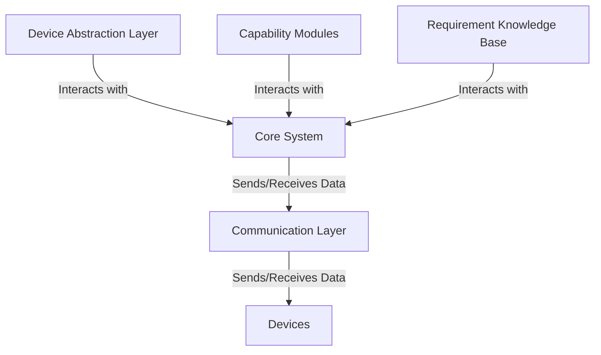

# GenUI Architecture
The architecture of GenUI is designed to be modular and extensible to accomodate various devices, capabilites and requirements. It follows the Microkernel architecture pattern. The core components include: 

## Device Abstraction Layer
The DAL provides a unified interface for interacting with different devices. It abstracts the underlying hardware to a machine readable format, which can be used by the core system. Examples of devices include:
- Sensors
- Actuators
- Smart Glasses
- MR Headsets
- Smartphones
- Smartwatches

It includes a well-defined API with its affordances and capabilities. A possible implementation could be based on ThingDescriptions or a simple JSON schema or MCP Servers. 

## Capability Modules
These modules implement specific functionalities that can be added or removed on runtime. Each capability module interacts with the core system through well-defined interfaces. Examples of capabilities include:
- Data Collection (e.g. Gaze Tracking)
- Data Processing (e.g. Blink Detection)
- User Interaction (e.g. Notifications, Alerts)

## Requirement Knowledge Base
The requirement knowledge base stores information about user needs, preferences, and context. It helps the system to adapt its behavior based on the current situation and user requirements. Since the core system is based on a LLM/VLM, the knowledge base can be queried and updated dynamically. Examples of requirements include:
- Accessibility Needs (e.g. WCAG Compliance guidelines)
- Environmental Context (e.g. Noisy/Loud environment)
- User Preferences (e.g. Notification Settings, Display Preferences)
- Specific guidelines or norms (e.g. Research Papers, Company Policies, Corporate Identity Guidelines)

## Core System
The core system manages the overall operation of GenUI. It orchestrates the interaction between the DAL, capability modules and the requirement knowledge base. It is based on a LLM/VLM, which allows it to process natural language inputs and generate appropriate machine readable outputs to the different devices through structured output. The core system is responsible for the generation of the appropriate user interface and the adaptation of the system based on user requirements and context.

# Communication Layer 
The communication layer is a well-formed API that allows seamles interaction between the different components of the system. It is based on standard web protocols (e.g. REST, WebSockets) to ensure compatibility and ease of integration. 

## Workflow
1. The connected device sends a request to the core system through the communication layer which includes information about itself and it's capabilities.
2. The core system is able to query the requirement knowledgebase (maybe RAG?) to understand the user needs and context. It leverages the tooling capabilities of the LLM/VLM to determine if additional information should be collected from the capability modules.
3. The core system sends requests to the relevant capability modules to collect additional data or perform specific actions.
4. The capability modules process the requests and send the results back to the core system.
5. The core system generates a response based on the collected data and user requirements, and sends it back to the device through the communication layer.
6. The device receives the response and presents the appropriate user interface or performs the requested action.
7. The user interacts with the generated UI and the user input is either sent to the specific Device (e.g. button press, which triggers an actuator) or back to the core system to further refine the user interface or perform additional actions.

# Extensibility
The modular design of GenUI allows for easy addition of new devices, capabilities, and requirements. New device types can be integrated by implementing the DAL interface. New capabilities can be added as separate modules that interact with the core system. The requirement knowledge base can be expanded to include new user needs and preferences.

# Implementation Use Case
The initial PoC will be following this use case: 
- Device: 
    - MR Headset (e.g. HoloLens) [Device A]
    - Robotic Arm [Device B]
- Capabilities: Activity Detection System [Capability Module A] (theoretically Render system but out of scope for technical reasons)
- Requirements: Accessibility Needs (WCAG Compliance guidelines, MS Interaction Guidelines), Norms (SituationAdapt paper) [Requirement Knowledge Base A]

Setup: 
User wears the MR Headset and is working in MR. He wants to pause the robotic Arm to safely grab a grate. The user can interact with the robotic arm through the MR Headset to stop the arm. The user then grabs the grate and wants to resume the arm while his hands are occupied. The activity detection system detects that the user is grabbing the grate and sends this information to the core system. The core system queries the requirement knowledge base to understand the user's needs and context. It determines that the user is currently occupied and generates a voice command/gaze enabled interface to allow the user to resume the robotic arm without using his hands. The robotic arm receives the command and resumes its operation, ensuring a seamless and safe interaction for the user.
Stretch goal: While walking, the user interacts with a colleague and starts a conversation. The activity detection system detects the conversation and sends this information to the core system. The core system queries the requirement knowledge base to understand the user's needs and context. It determines that the user is currently engaged in a conversation and adjusts the user interface to minimize distractions/move the UI to the periphery of the user's vision. The MR Headset receives the updated interface and presents it to the user, allowing them to continue their conversation without being interrupted by the robotic arm's operation.

# Diagram

Questions 
- Device Abstraction Layer: Ok. But how does this differ/interact with the capability modules? I like that you opened this up to include (simple!) sensors. 
I wanted to separate these since the DAL is more about the low-level interfacing with the device, while the capability modules are about higher-level functionalities that can be built on top of the DAL but not necessary from the same device. Imagine a separate system which detects the user activity (so a capability module) but won't have an output. But you're right, if it's the same device, it might be redundant, especially if we rely on a mixture of DAL and capability modules.
- Capability Modules: Same question. Or is the "capability module" a type of higher-level abstraction of the DAL functions? Correct :)
- Requirement Knowledge Base: Yes, this is very well put! The core novelty of the LLM in this KB is that it Permits the Integration of a Variety of requirements - in the form of personal Preferences, but also in the form of Research papers. I like this way of seeing it! For the examples of requirements, these are rather "requirement groups". I'd like to see specific examples, like in the other two modules. 
- Core System: Yes, as discussed 
- Communication Layer: This is underdefined. To understand this, it is required to know whether the different modules run on different systems or not... 
The idea was, that it potentially runs on different systems, e.g. the DAL on an edge device, the capability modules on a server, and the core system on another server. Since I'm unsure yet about the exact technology used (e.g. MCP servers or direct access through REST APIs), I kept it rather generic. But you're right, this needs to be defined more clearly.
- Flow 1. Ok, so both DAL and Capabilities come from the device. Why then separate them? 2-6. So I understand that the "run time" already starts here. We're in the middle of the UI generation/usage aleady. 
Let's discuss this in more detail :) 
7. Usage of the UI is missing here.

In addition to these questions, can you formulate the specific devices that you want to tune for? Is it an MR Headset and a simple sensor, to show diversity? I think that the perspective formulated in the "Requirement Knowledge Base" can help a lot.

